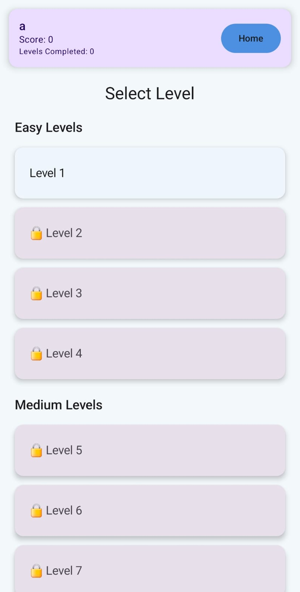
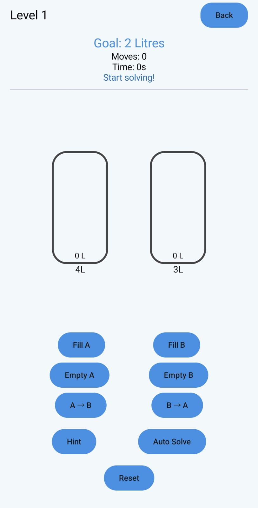
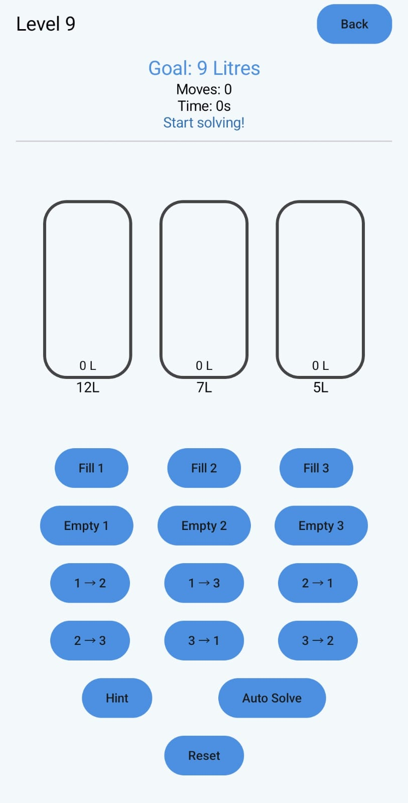

# 🧠 Water Jug Puzzle Game (AI Solver)

An **Android puzzle game based on the classical Water Jug Problem from Artificial Intelligence**.

The goal is to measure a **specific quantity of water using jugs with fixed capacities** by performing operations such as **fill, empty, and pour**.

The application also includes an **AI solver that computes optimal solutions using Breadth-First Search (BFS)**.

---

# 📱 Features

## 🎮 Puzzle Gameplay

* Interactive **water jug simulation**
* Perform operations:

  * Fill a jug
  * Empty a jug
  * Pour water between jugs
* Real-time **water level visualization**

---

## 🧩 Multiple Levels

The game contains **20 puzzle levels** with increasing difficulty:

| Difficulty    | Description                |
| ------------- | -------------------------- |
| Easy          | Basic jug combinations     |
| Medium        | More complex targets       |
| Hard          | Multi-step solutions       |
| Advanced Hard | Requires optimal reasoning |

---

## 🤖 AI Powered Hint System

The hint system analyzes the **current puzzle state** and suggests the **optimal next move** using the BFS solver.

This allows players to **learn the solving strategy step-by-step**.

---

## ⚡ Auto Solve

The AI can automatically compute and demonstrate the **complete optimal solution** from the current state.

This feature shows the **shortest sequence of operations needed to reach the target amount**.

---

## 📊 Score System

Scores are calculated based on:

* Number of moves
* Time taken
* Hint usage

Better performance results in **higher scores and better rankings**.

---

## 💾 Progress Tracking

The application stores:

* Best score for each level
* Total levels completed
* Player progress

All data is stored locally using **SharedPreferences**.

---

# 🧠 AI Algorithm Used

The puzzle is modeled as a **state-space search problem**.

Each configuration of water inside the jugs represents a **state**.

The solver uses **Breadth-First Search (BFS)** to explore possible states and determine the optimal sequence of actions required to reach the target amount.

### BFS Guarantees

* ✔ Optimal solution (minimum number of moves)
* ✔ Complete search of all valid states
* ✔ Efficient exploration using visited state tracking

---

# 🛠 Tech Stack

| Technology        | Purpose                 |
| ----------------- | ----------------------- |
| Kotlin            | Programming Language    |
| Android Studio    | Development Environment |
| Jetpack Compose   | UI Framework            |
| BFS Algorithm     | AI Solver               |
| SharedPreferences | Local Data Storage      |
| Git & GitHub      | Version Control         |

---

# 🎮 Game Controls

Players can perform the following operations:

* **Fill Jug** – Fill a jug to its maximum capacity
* **Empty Jug** – Remove all water from a jug
* **Pour** – Transfer water from one jug to another

### Objective

Measure the **target water quantity in any jug**.

---

# 📂 Project Structure

```
App/
 ├── data/
 │    ├── LevelRepository.kt
 │    ├── UserManager.kt
 │
 ├── ui/
 │    ├── GameScreen.kt
 │    ├── LevelSelectScreen.kt
 │
 ├── solver/
 │    ├── WaterJugSolver.kt
 │    ├── MultiJugSolver.kt
 │    ├── MultiJugHintSolver.kt
 │
 ├── components/
 │    ├── JugView.kt
```

## 📸 App Screenshots

<p align="center">
  
  
  
</p>

---

# 🚀 How to Run

### 1️⃣ Clone the repository

```
git clone https://github.com/mahe510/WaterJug-game.git
```

### 2️⃣ Open in Android Studio

Open the project folder in **Android Studio**.

### 3️⃣ Sync Gradle

Allow Android Studio to download the required dependencies.

### 4️⃣ Run the Application

Run the app on:

* Android Emulator
  or
* Physical Android Device

---

# 📦 APK Download

You can download and install the APK from the link below:

```
https://drive.google.com/file/d/1aR54Rdr5KRBEvPLcwAvPHRse7k-OxxfR/view?usp=sharing
```


